# 🤖 TelecomX LATAM — Predicción de Cancelación de Clientes (Churn)


## 📋 Descripción

Este proyecto forma parte del **Challenge de Data Science — TelecomX LATAM**.  
A partir de datos reales de clientes, se construyó un pipeline completo de análisis y predicción de cancelación (churn), combinando un Análisis Exploratorio de Datos (EDA) con modelos de Machine Learning.

> **Tasa de cancelación detectada: 26.5%** sobre una base de 7,032 clientes analizados.

---

## 🗂️ Estructura del Repositorio

```
telecomx-challenge-part2/
│
├── 📁 notebooks/
│   └── telecomx_challenge_part2.ipynb
│
├── 📁 data/
│   └── TelecomX_Data.json
│
├── 📁 images/
│   └── (14 visualizaciones generadas)
│
├── .gitignore
├── LICENSE
└── README.md
```

---

## 🗺️ Estructura del Notebook

| # | Sección | Descripción |
|---|---|---|
| 1 | 📥 Extracción y Limpieza | Pipeline ETL completo desde JSON |
| 2 | 🛠️ Preparación para ML | Encoding, SMOTE, normalización |
| 3 | 📊 Contexto Visual — EDA | 10 visualizaciones exploratorias |
| 4 | 🎯 Correlación y Selección | Matriz de correlación y análisis dirigido |
| 5 | 🤖 Modelado Predictivo | Regresión Logística + Random Forest |
| 6 | 📋 Evaluación | Métricas, matrices de confusión, curvas ROC |
| 7 | 🔍 Interpretación | Importancia de variables por modelo |
| 8 | 📄 Conclusión Estratégica | Hallazgos y recomendaciones de negocio |

---

## 📊 Análisis Exploratorio (EDA)

### Distribución de la Variable Objetivo
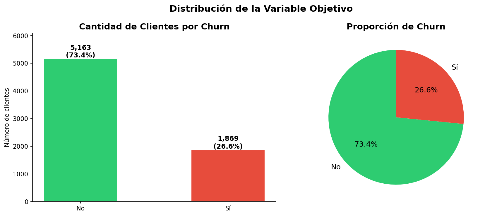

### Tasa de Churn por Variables Categóricas
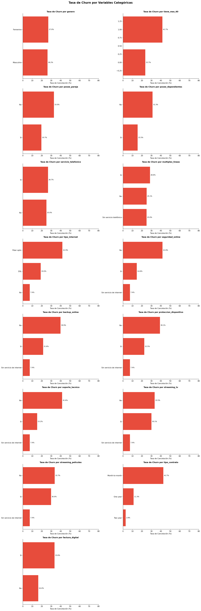

### Tasa de Churn por Tipo de Contrato
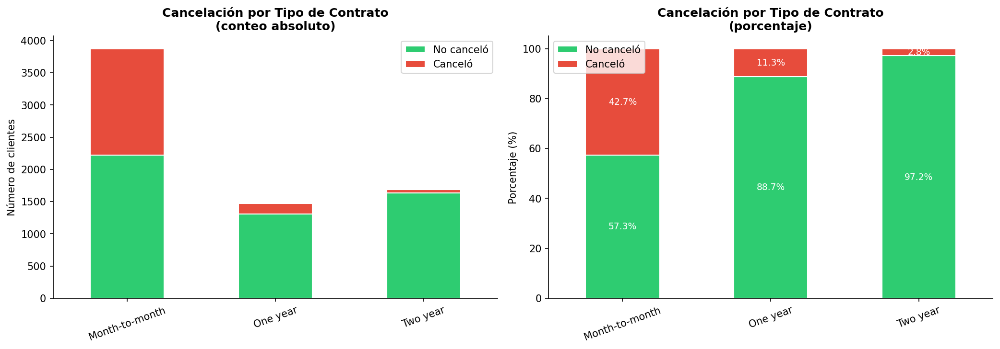

### Distribución de Variables Numéricas por Churn
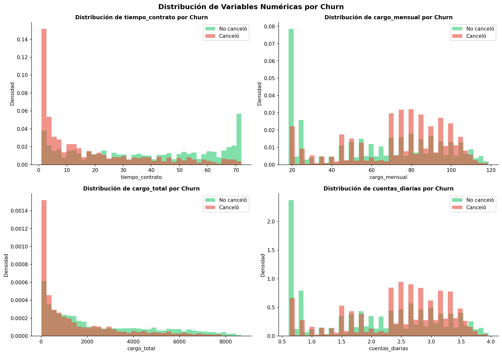

### Boxplot de Variables Numéricas por Churn
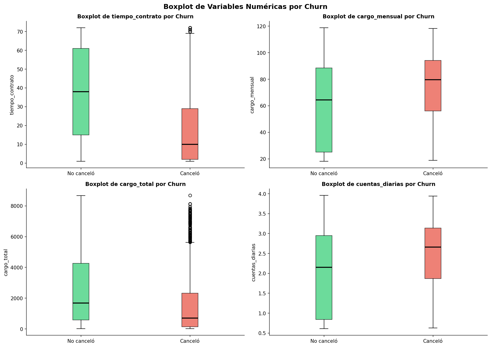

### Tasa de Churn por Grupo de Antigüedad
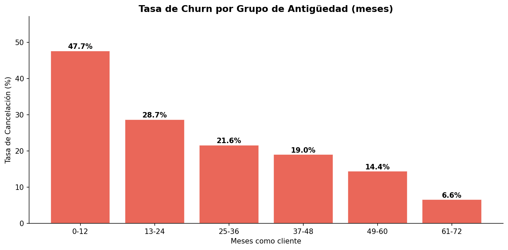

### Tasa de Churn por Rango de Cargo Mensual
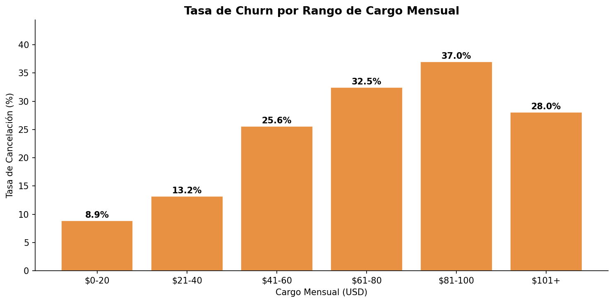

### Tasa de Churn por Rango de Cargo Total
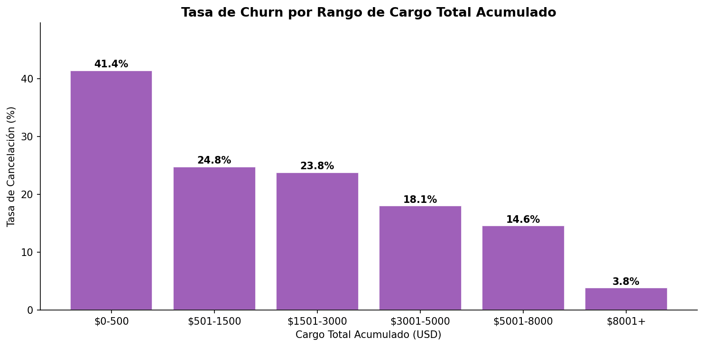

### Cargo Mensual vs Antigüedad por Churn
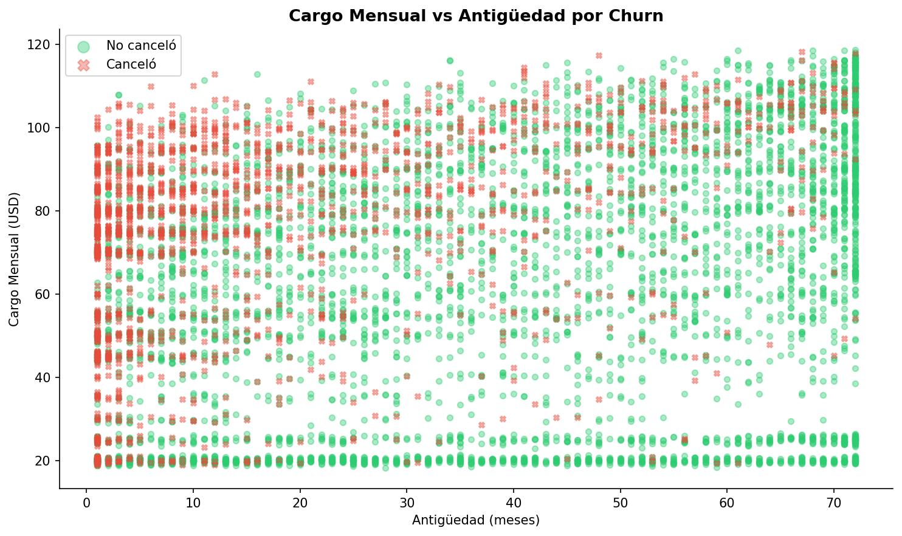

### Matriz de Correlación con Churn
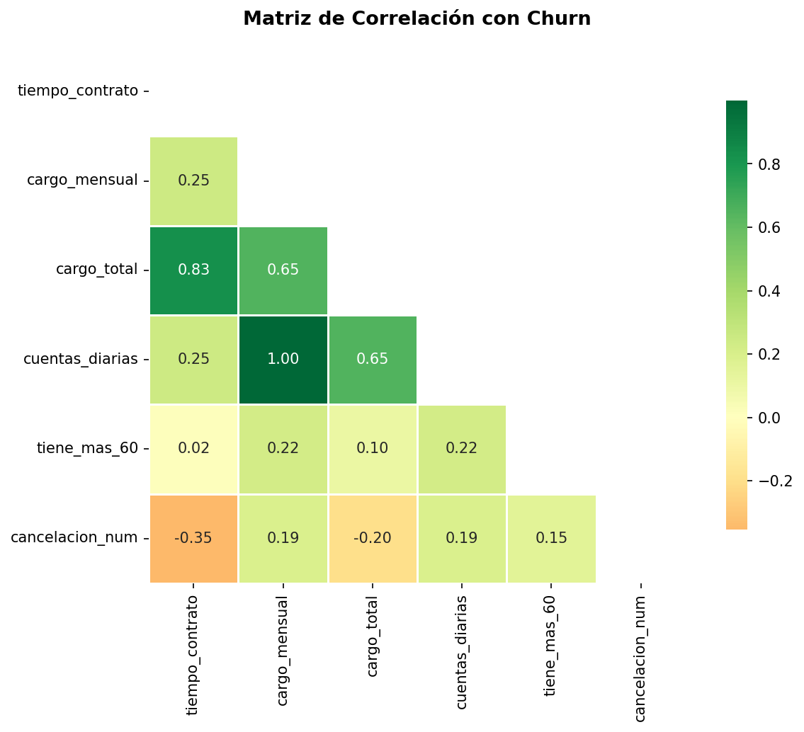

---

## 🤖 Modelado Predictivo

### Matrices de Confusión
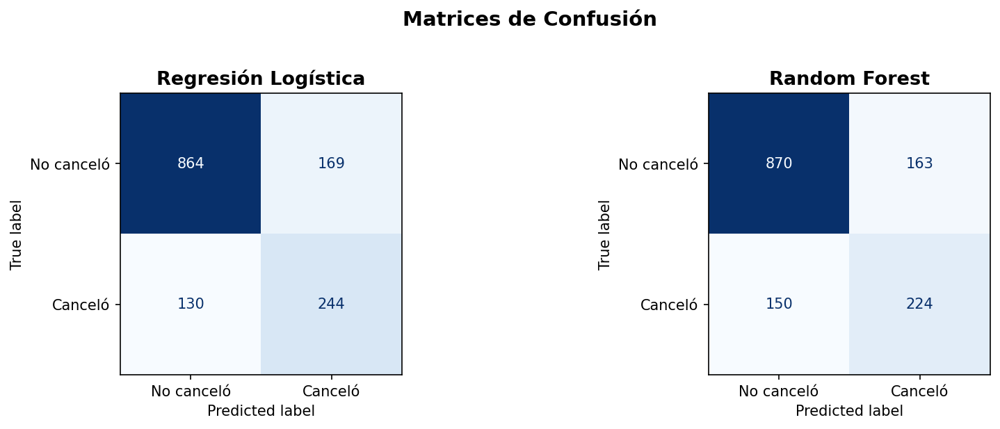

### Curvas ROC — Comparación de Modelos
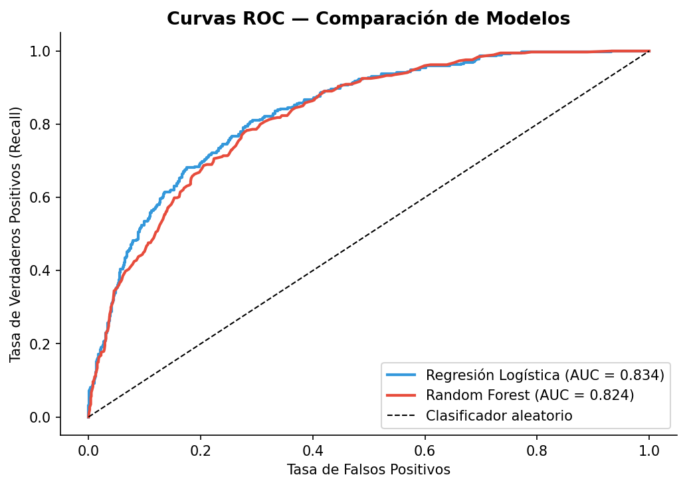

### Top 15 Variables — Regresión Logística
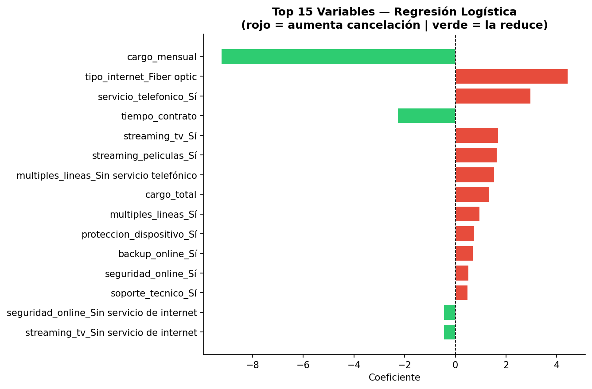

### Top 15 Variables — Random Forest
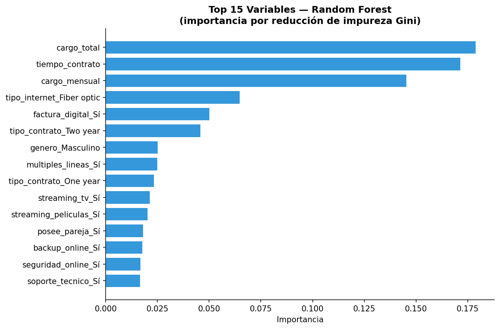

---

## 📈 Resultados de los Modelos

| Modelo | ROC-AUC | Requiere Normalización |
|---|---|---|
| Regresión Logística | ~0.84 | ✅ Sí |
| Random Forest | ~0.87 | ❌ No |

> **Random Forest** obtuvo el mejor desempeño con mayor AUC y mejor detección de la clase minoritaria.

---

## 🔴 Principales Factores de Cancelación

| # | Factor | Impacto |
|---|---|---|
| 1 | Contrato mes a mes | ~42.7% de cancelación |
| 2 | Primeros 12 meses | ~48% de clientes nuevos cancela |
| 3 | Cargo mensual elevado | Promedio $74.44 vs $61.27 |
| 4 | Fibra óptica | ~42% de cancelación |
| 5 | Cheque electrónico | ~45% de cancelación |

---

## 💡 Recomendaciones Estratégicas

| # | Acción | Impacto |
|---|---|---|
| 1 | Incentivar contratos anuales/bianuales con descuentos | 🔴 Alto |
| 2 | Programa de onboarding intensivo primeros 12 meses | 🔴 Alto |
| 3 | Revisar calidad del servicio de Fibra Óptica | 🟠 Medio |
| 4 | Migrar clientes de cheque electrónico a débito automático | 🟠 Medio |
| 5 | Implementar modelo Random Forest para alertas tempranas | 🔴 Alto |

---

## 🛠️ Tecnologías Utilizadas

- **Python 3.10**
- **Pandas / NumPy** — manipulación de datos
- **Matplotlib / Seaborn** — visualizaciones
- **Scikit-learn** — modelos de ML y métricas
- **Imbalanced-learn** — balanceo con SMOTE
- **Google Colab** — entorno de ejecución

---

## 🚀 Cómo Ejecutar

1. Abre el notebook en Google Colab:  
   [](https://colab.research.google.com/github/JeaLPaHu/telecomx-challenge-part2/blob/main/notebooks/telecomx_challenge_part2.ipynb)

2. Ejecuta `Runtime → Run all`

3. Las 14 imágenes se descargarán automáticamente

---

## 👤 Autor

**JeaLPaHu**  
[](https://github.com/JeaLPaHu)

---

*Challenge Data Science — TelecomX LATAM* 🚀
